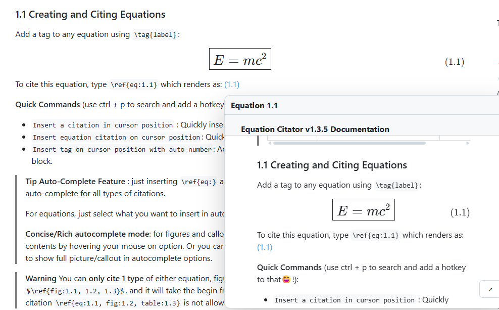

# equation-citator-webnote
## Introduction 
Web citation grammar support for Equation Citator exported citations. Including web  citations support for equations, figures and custom callouts. 

This package is designed for pages that already contain Equation Citator exported citation spans:

```html
<span class="equation-citator-citation" data-ec-kind="eq" data-ec-refs="[...]">...</span>
```



This package provides two entry points:

- `equation-citator/markdown-it`: build-time target injection for Markdown-it.
- `equation-citator/runtime`: browser hover previews, stable target IDs, and navigation.

## Compatibility 

You can use `obsidian-equation-citator` plugin to generate the citation HTML label with correct format. For the obsidian equation-citator plugin, see https://github.com/FRIEDparrot/obsidian-equation-citator.

**Minor-version compatibility is applied**. That means, **equation-citator-webnote** (npm package) `v1.3.xx` is compatible with **obsidian-equation-citator** `v1.3.x`.

## Markdown-it

```js
import equationCitatorMarkdownIt from 'equation-citator/markdown-it'

md.use(equationCitatorMarkdownIt, {
  include: (env) => env.relativePath?.startsWith('knowledge-base/'),
  enableObsidianCallouts: true
})
```

This injects target metadata for math blocks with `\tag{...}`, figures, and Equation Citator callout blockquotes.

### Markdown repo path and image resolution

For Obsidian-style image embeds such as `![[img.png]]`, the markdown-it plugin needs to know which Markdown repository root contains the file being parsed. Markdown-it itself does not provide a stable final webpage URL during build, so `pathMapping` is required.

`pathMapping` maps each web repo link to the matching Markdown repo path, the format is : 
```ts
pathMapping: [
  { webRoot: markdownSourceRoot }
]
```
where markdownSourceRoot is the root you used to render the markdown file, for example, the markdown file is   

```js
md.use(equationCitatorMarkdownIt, {
  pathMapping: [
    { 'your-website.com/knowledge-base': 'docs/knowledge-base' }
  ]
})
/// in that case, you call : 
const contentHtml = markdownIt.render(markdown, env); 
/*
 * if env.markdwonPath is 'docs/knowledge-base/../img.png' with relative path to knowledge-base, it will be resolved as `/knowledge-base/../image.png`
 */
```

When parsing `docs/knowledge-base/Equation-Citator-Tutorial/Quick Start.md`, the plugin selects the first mapping whose Markdown repo path matches the file path. Then `![[Equation-Citator-Tutorial/assets/Equation Citator Logo.png]]` resolves to `/knowledge-base/Equation-Citator-Tutorial/assets/Equation%20Citator%20Logo.png`.

The plugin reads the parsed file path from `env.markdownPath`. If your build tool exposes another source path shape, set `env.markdownPath` before the plugin rule runs:

```js
md.core.ruler.before('inline', 'repo-markdown-path', (state) => {
  state.env.markdownPath = `docs/${state.env.relativePath}`
})
```

Multiple mappings are supported. The first entry whose Markdown repo path matches the file being parsed is used.

For exported cross-file citations, the markdown-it plugin enriches each ref that has `file` with a resolved `local` URL inside `data-ec-refs`. The runtime uses this `local` URL for cross-file preview and navigation; it does not recompute file paths in the browser.

## Runtime

```js
import { install } from 'equation-citator/runtime'

install({ router })
```

The runtime file should be copied into assets/runtime.js when building the docs because the generated docs pages need it in the browser. 

